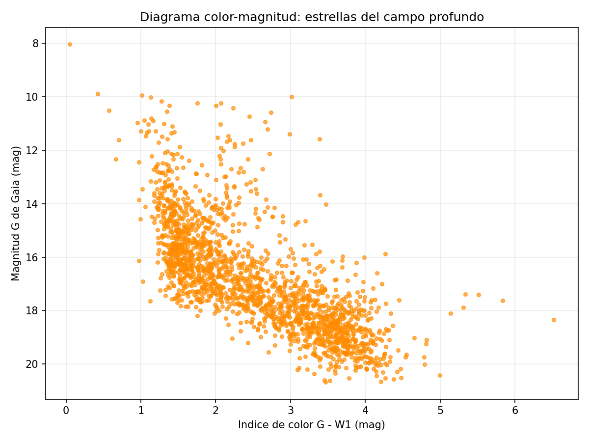

# Diseccion de un campo profundo multi-longitud de onda

**Curso:** Minería de datos para astronomía

**Fecha:** 5 de octubre de 2026

**Autores:**

- Marhia Jose Granada Restrepo
- Carlos Eduardo Orozco Garcés

Campo centrado en **RA = 135.5 grados**, **Dec = 0.5 grados**, con radio de **0.5 grados**.

<details>
<summary><strong>Estudiante A: El Cartografo Galactico (VizieR)</strong></summary>

### Consulta y procesamiento

El pipeline consulta directamente el servicio TAP de VizieR mediante ADQL. Gaia DR3 se conserva como catalogo principal y se cruza con AllWISE usando un `LEFT JOIN` y un radio de coincidencia de 2 segundos de arco.

Una paralaje positiva por si sola puede aparecer por ruido. Para seleccionar estrellas de la Via Lactea se conservaron fuentes con paralaje positiva y con una relacion `Plx/e_Plx >= 3`. Para el diagrama tambien se eliminaron las filas sin `Gmag` o sin `W1mag`.

El indice de color se calcula como:

```text
G - W1 = Gmag - W1mag
```

La magnitud `Gmag` se representa en el eje vertical invertido, porque en la escala de magnitudes los objetos mas brillantes tienen valores menores.

### Archivos

- `consulta_vizier.sh`: consulta ADQL escrita y enviada con `wget`.
- `analisis_vizier.py`: limpieza con pandas y grafica con matplotlib.
- `proyecto_estudiante_a.ipynb`: cuaderno para ejecutar el trabajo en Google Colab.
- `resultados/diagrama_color_magnitud.png`: diagrama color-magnitud obtenido.
- `resultados/gaia_allwise_limpio.csv`: muestra final usada para la grafica.

### Ejecucion

```bash
bash consulta_vizier.sh
python3 analisis_vizier.py
```

En Google Colab se debe abrir `proyecto_estudiante_a.ipynb` y ejecutar las celdas en orden.

</details>

<details>
<summary><strong>Estudiante B: El Cosmologo (SDSS y MAST)</strong></summary>

### Consulta y procesamiento

El pipeline consulta el SkyServer de SDSS enviando una petición SQL vía Bash. Se utiliza un `INNER JOIN` para unir `PhotoObj` (fotometría) y `SpecObj` (espectroscopía), limitando el área espacial con `dbo.fGetNearbyObjEq` a un radio de 30 minutos de arco para igualar el campo del Estudiante A.

Se extraen el corrimiento al rojo (`z`), la clasificación (`class`) y las magnitudes (`u`, `g`). Tras limpiar valores nulos con Pandas, se define el índice de color:

```text
Índice de color = u - g
```

Luego, se grafica con Seaborn el Corrimiento al Rojo vs Índice de Color, diferenciando visualmente Galaxias y Cuásares. Paralelamente, se verificó en el portal MAST (`135.5, 0.5 r=0.5d`) que existen observaciones del Telescopio Espacial Hubble (HST) para estas coordenadas exactas.

### Archivos

- `datos/sdss_datos.csv`: Datos cruzados descargados desde SDSS.
- Código en Colab: Celdas combinadas de Bash (extracción SQL) y Python (limpieza y análisis).

### Ejecución

El flujo se ejecuta secuencialmente en Google Colab:
1. Ejecutar la celda Bash para construir la URL y descargar los datos con `wget`.
2. Ejecutar la celda Python para procesar el CSV y desplegar la gráfica final.
</details>

<details>
<summary><strong>Analisis de resultados</strong></summary>

### Resultados de Gaia DR3 y AllWISE



El cruce optico-infrarrojo permite comparar la emision registrada por Gaia con la emision a mayor longitud de onda registrada por AllWISE. Los distintos valores de `G-W1` reflejan diferencias de temperatura y tambien pueden mostrar el efecto del polvo, que atenúa con mayor intensidad la luz optica que la infrarroja.

En la ejecucion realizada se obtuvieron **1.884 estrellas galacticas con fotometria completa**. En el diagrama se observa una secuencia estelar inclinada: las fuentes de menor magnitud G, es decir las mas brillantes, tienden a presentar colores `G-W1` menores; la poblacion mas tenue se concentra aproximadamente entre `G-W1 = 3` y `G-W1 = 4`. Los puntos mas alejados de la secuencia pueden corresponder a fuentes con propiedades fisicas distintas o a objetos afectados por polvo.

### Resultados de SDSS

La consulta conjunta de fotometria y espectroscopia de SDSS produjo **252 objetos** con datos completos: **151 galaxias, 40 cuasares y 61 estrellas**. Las estrellas presentan corrimientos al rojo cercanos a cero, como se espera para objetos de la Via Lactea. Las galaxias tienen una mediana de `z = 0.47` y de `u-g = 1.46`, mientras los cuasares alcanzan una mediana de `z = 1.47` y de `u-g = 0.46`.

La diferencia en corrimiento al rojo separa claramente las poblaciones: las galaxias y, sobre todo, los cuasares se encuentran a distancias cosmologicas, mientras las estrellas son fuentes locales. En esta muestra los cuasares tienden a presentar un color ultravioleta-verde mas azul que las galaxias, aunque existe dispersion y algunos objetos se superponen. Por esta razon el color por si solo no determina de forma definitiva la naturaleza de una fuente; la clasificacion espectroscopica es necesaria para confirmarla.

### Exploracion en MAST

La busqueda en MAST para el mismo campo muestra **31 registros de HST**. En la captura incluida en `proyecto_estudiante_b.ipynb` aparecen observaciones con el instrumento **ACS/WFC** y sus huellas cubren distintas zonas del campo. No se observan resultados de JWST en la evidencia guardada. Los registros visibles estan identificados como datos de calibracion, por lo que antes de utilizarlos en un analisis cientifico se debe revisar cada producto y comprobar su cobertura, filtro y tiempo de exposicion.

### ¿Por que combinar observaciones opticas e infrarrojas?

Ninguna banda muestra por si sola toda la poblacion del campo. La luz optica de Gaia permite medir posiciones y magnitudes con gran precision, pero es afectada fuertemente por el polvo interestelar. La radiacion infrarroja medida por AllWISE atraviesa mejor el polvo y tambien revela objetos frios o fuentes con emision termica que pueden ser debiles en el optico.

El indice `G-W1` compara ambas regiones del espectro. Un valor grande indica que la fuente es relativamente mas brillante en infrarrojo; esto puede deberse a una temperatura baja, polvo alrededor de la fuente o enrojecimiento a lo largo de la linea de vision. Combinar las bandas reduce sesgos de seleccion y permite distinguir poblaciones que pueden parecer similares cuando se observa una sola longitud de onda.

### ¿Como se complementan Gaia y SDSS?

Gaia aporta astrometria y cinematica. Una fuente con paralaje significativa y movimiento propio medible se encuentra dentro de la Via Lactea y se puede identificar como una estrella cercana. En cambio, una galaxia o un cuasar esta tan lejos que su paralaje y movimiento propio deben ser practicamente nulos dentro de la precision observacional.

SDSS aporta el espectro y el corrimiento al rojo. Las lineas espectrales permiten clasificar el objeto como estrella, galaxia o cuasar, y el desplazamiento de estas lineas determina `z`. Un cuasar presenta un corrimiento al rojo cosmologico y una firma espectral asociada a la actividad de un nucleo galactico, aunque en una imagen pueda parecer un simple punto de luz.

Las dos herramientas proporcionan pruebas independientes y complementarias: Gaia confirma el caracter local mediante paralaje y movimiento propio, mientras SDSS confirma el caracter extragalactico mediante espectroscopia y corrimiento al rojo. Por ello, un punto con movimiento propio y paralaje significativos es compatible con una estrella; uno sin movimiento aparente, con espectro de cuasar y `z` elevado, corresponde a un nucleo galactico activo situado a miles de millones de años luz.

</details>
